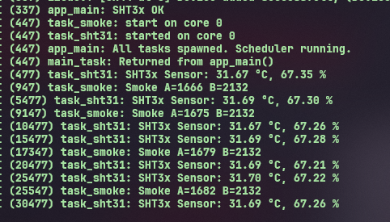

## Demo 
    Task read sensor smoke run core 0 and print the value on terminal mode standby default 8s.

    Task read temperature and humidity run core 0 and print the value on terminal 5s  

    Two tasks run parallel on core 0 using freeRTOS basic 
    
