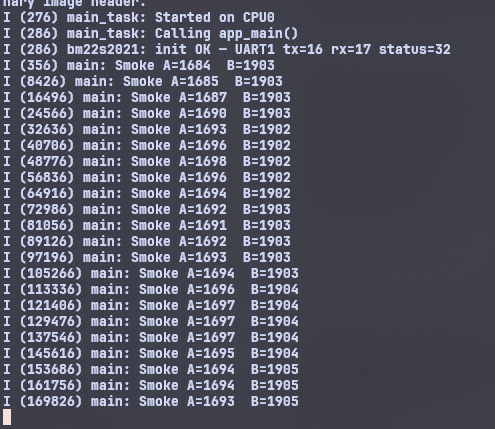

# `bm22s2021` Sensor

Code Driver bm22s2021 của BEST MODULES CORP được chuyển từ thư viện Arduino v1.0.2

---

## Hardware

| Signal      | Direction | Description                                      |
|-------------|-----------|--------------------------------------------------|
| UART TX     | ESP → MCU | Send commands to module                          |
| UART RX     | MCU → ESP | Receive responses / auto-TX packets              |
| STATUS pin  | MCU → ESP | HIGH = alarm active (configurable active level)  |
| VCC         | —         | 3.3 V or 5 V (check module datasheet)            |
| GND         | —         | Common ground                                    |

UART settings: **9600 baud, 8N1, no flow control**.

---

## Quick start

### 1. Add the component

Copy the `bm22s2021/` folder into your project's `components/` directory.


### 2. Basic usage — poll mode

```c
#include "bm22s2021.h"

void app_main(void)
{
    bm22s2021_dev_t  smoke;
    bm22s2021_config_t cfg = {
        .uart_port  = UART_NUM_1,
        .tx_pin     = GPIO_NUM_17,   // ESP TX  → module RX
        .rx_pin     = GPIO_NUM_16,   // ESP RX  ← module TX
        .status_pin = GPIO_NUM_5,    // STATUS  ← module STATUS
    };

    ESP_ERROR_CHECK(bm22s2021_init(&smoke, &cfg));

    uint8_t data[41];
    while (1) {
        if (bm22s2021_request_info_package(&smoke, data) == ESP_OK) {
            uint16_t smoke_a = (data[17] << 8) | data[16];
            uint16_t smoke_b = (data[19] << 8) | data[18];
            ESP_LOGI("main", "Smoke A=%u  B=%u", smoke_a, smoke_b);
        }
        vTaskDelay(pdMS_TO_TICKS(8000));
    }
}
```

### 3. Auto-TX mode (non-blocking check)

```c
// In your task loop:
uint8_t pkt[41];
if (bm22s2021_is_info_available(&smoke)) {
    bm22s2021_read_info_package(&smoke, pkt);
    uint16_t smoke_a = (pkt[17] << 8) | pkt[16];
    ESP_LOGI("main", "Smoke A=%u", smoke_a);
}
```

### 4. STATUS pin alarm check

```c
if (bm22s2021_get_status_pin(&smoke) == 1) {
    ESP_LOGW("main", "SMOKE ALARM!");
}
```

### 5. Air calibration (blocking ~8 s)

```c
ESP_LOGI("main", "Starting air calibration...");
if (bm22s2021_calibrate(&smoke) == ESP_OK) {
    ESP_LOGI("main", "Calibration successful");
} else {
    ESP_LOGE("main", "Calibration failed");
}
```

---

## Info packet layout (41-byte full packet)

| Byte(s)   | Content                                  |
|-----------|------------------------------------------|
| 0         | Header `0xAA`                            |
| 1         | Length `0x29` (= 41)                     |
| 2–3       | Fixed `0x11 0x01`                        |
| 4         | Command echo `0xAC`                      |
| 5         | Equipment status                         |
| 16–17     | T0A smoke detection value (Lo, Hi)       |
| 18–19     | T0B smoke detection value (Lo, Hi)       |
| 40        | Checksum (two's complement)              |

---

## API summary
AI convert from source sample code, generate and edited by me. 
Link :https://github.com/BestModules-Libraries/BM22S2021-1 

| Function                           | Description                               |
|------------------------------------|-------------------------------------------|
| `bm22s2021_init()`                 | Initialise UART + GPIO                   |
| `bm22s2021_deinit()`               | Release UART driver                      |
| `bm22s2021_get_status_pin()`       | Read alarm GPIO level                    |
| `bm22s2021_get_fw_ver()`           | Firmware version (BCD)                   |
| `bm22s2021_get_prod_date()`        | Production date (BCD)                    |
| `bm22s2021_request_info_package()` | Poll: request 41-byte data packet        |
| `bm22s2021_is_info_available()`    | Auto-TX: check for valid packet in buffer|
| `bm22s2021_read_info_package()`    | Auto-TX: copy cached packet              |
| `bm22s2021_read_register()`        | Read config register by address          |
| `bm22s2021_write_register()`       | Write config register by address         |
| `bm22s2021_read_running_var()`     | Read live sensor variable                |
| `bm22s2021_get/set_auto_tx()`      | Auto-TX packet mode                      |
| `bm22s2021_get/set_t0a_threshold()`| T0A alarm threshold (16-bit)            |
| `bm22s2021_get/set_t0b_threshold()`| T0B alarm threshold (16-bit)            |
| `bm22s2021_calibrate()`            | Trigger air calibration (~8 s)           |
| `bm22s2021_reset()`                | Software reset                           |
| `bm22s2021_restore_default()`      | Restore factory defaults                 |

---

## Factory defaults

| Parameter               | Default      |
|-------------------------|--------------|
| T0A calibration range   | 0x19 – 0xC8  |
| T0B calibration range   | 0x19 – 0xC8  |
| T0A alarm threshold     | 0x015E       |
| T0B alarm threshold     | 0x0096       |
| Detect cycle            | 8 s          |
| Auto-TX mode            | 0x80 (41-byte full) |
| STATUS pin active level | HIGH (0x80)  |

## Demo poll mode 

