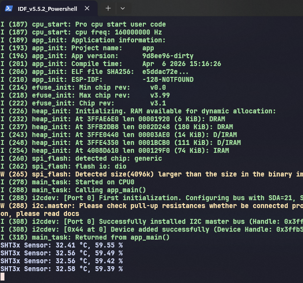

# Example for Sht3x driver giao tiếp I2C

## Kết nối phần cứng 
| Chân SHT3x | Chức năng       | Kết nối với ESP32           | Ghi chú                           |
| ---------- | --------------- | --------------------------- | --------------------------------- |
| VCC        | Nguồn cấp       | 3.3V                        | ⚠️ Không dùng 5V (ESP32 là 3.3V)  |
| GND        | Mass            | GND                         | Chung mass                        |
| SDA        | Dữ liệu I2C     | GPIO21 (SDA)                | Có thể đổi chân khác nếu cấu hình |
| SCL        | Clock I2C       | GPIO22 (SCL)                | Có thể đổi chân khác nếu cấu hình |
| ADDR       | Địa chỉ I2C     | GND hoặc VCC                | GND = 0x44, VCC = 0x45            |
| ALERT      | Ngắt (optional) | Không cần nối / GPIO bất kỳ | Tùy dùng                          |

## Tham khảo

    Link :https://github.com/UncleRus/esp-idf-lib 

## Demo kết quả đọc cảm biến

