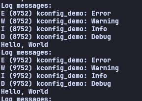

# Học Kconfig với framwork ESP-IDF

## Mục đích 

### 1. Quản lý cấu hình dự án 
    
    - Cho phép bật/tắt các tính năng hệ thống thông qua giao diện cấu hình khi chạy 
```
    idf.py menuconfig
```
### 2. Tùy chỉnh firmware theo nhu cầu
    - Không nên chỉnh sửa file sdkconfig tránh sai xót
    - Tự tùy chỉnh để override lên các config default
### 3. Hỗ trợ build system (CMake)

    Tích hợp với hệ thống build của ESP-IDF:
        - Quản lý các components và bật/tắt để có thể sử dụng chúng.

    Ví dụ: 
```
    CONFIG_LOG_DEFAULT_LEVEL=4
    CONFIG_LOG_MAXIMUM_EQUALS_DEFAULT=y
```
```C
    #ifdef CONFIG_SAY_HELLO
        say_hello();
    #endif
```
## Kết quả  


